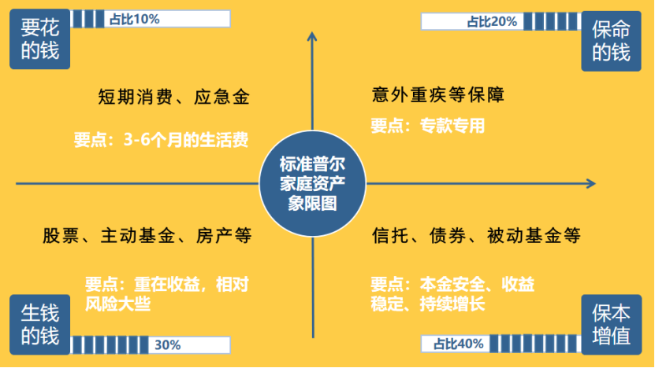
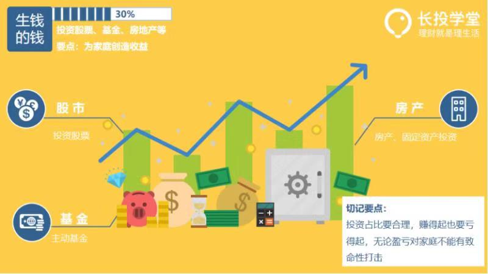

### 幸福人身的资产配置

###### 如何安排我们每个月的收入和家庭的资产
> 对自己的资金在各个资产之间进行合理安排的一个过程——资产配置

1. 要花的钱

> 满足短期消费，一般占比10%，一般放在银行活期存款或货币基金中，要用时能第一时间支取。忌占比过高。

2. 保命的钱

> 杠杆账户，一般占比20%。意外重疾保障，专款专用。

3. 生钱的钱
> 一般占比30%，要赚得起也要亏得起。重在收益。可以股票、基金五五分，动态挑换比例。

4. 保本增值的钱
> 一般占家庭资产的40%。为保障家庭成员的养老金、子女教育金，一定要保证本金不能损失，并要抵御通货膨胀的侵蚀。比较适合基金定投

- 不能随意去处。
- 每年或每月有固定的钱存入。
- 长期来看收益要稳定上升。