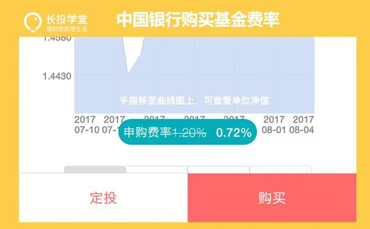
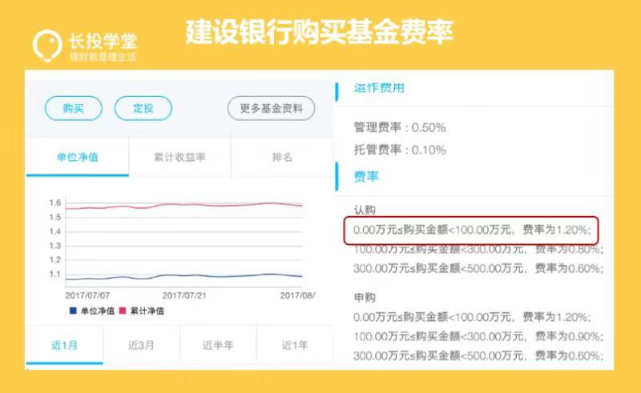
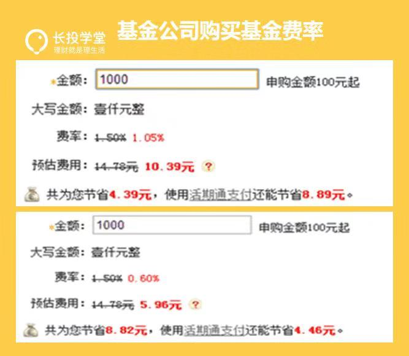
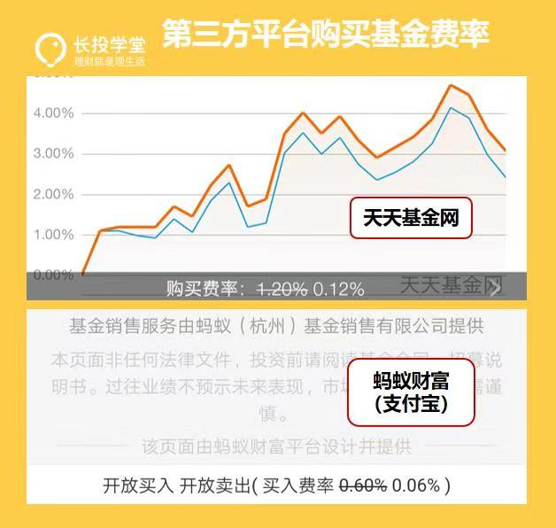

### 场内外基金来源渠道

#### 场内基金、场外基金

> 场：证劵交易市场。

- 通过证劵市场进行的交易统称为场内交易。

#### 基金定投的具体渠道

1. 证劵公司
2. 银行
3. 基金公司
4. 第三方代销平台

#### 场内、场外渠道的区别
1. 银行——加价不加量的国营小卖部

> 最低费率：约为万分之72

2. 基金公司——专卖店

> 最低费率：约为万分之15

3. 第三方代销——爱打折的百货商场

> 最低费率：约为万分之12

### 开户避坑

#### 去哪可以开户
- 证劵公司营业厅
- 网上开户（券商的PC网站或手机APP）

#### 挑选券商
- 比佣金
    - 是否包含规费
- 比品牌
- 比服务

