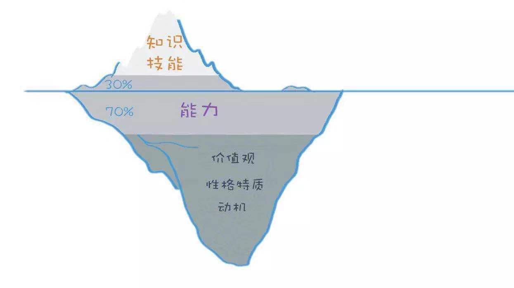

# 一个模型，帮你找到真正热爱的工作

### 知识与技能
> 如果你的工作中有很多陌生的内容，觉得每天都信息量很大、来不及接收，感到慌乱和焦虑，很可能就是你的知识技能跟岗位不匹配,属于特定领域

### 能力
**通用能力——学习能力、思考能力、人际交往能力等,属于通用领域**

> 如果工作效率、沟通效率较低，面对复杂的问题无从下手，缺乏成就感，力不从心。

### 价值观、性格、动机

- 价值观是你判断事物的标准——如果你在工作中经常陷入矛盾和纠结，对所做的事情很难发自内心地认同，很可能就是价值观上不匹配。

- 性格特质是个人的行为偏好——如果你在工作中发现，自己好像工作量没有很大，但却觉得心累，很有可能是性格不匹配。

- 动机——如果你感觉自己没有动力，做事提不起劲来，那很可能就是现在的工作和你的动机不匹配。
    - 成就动机——喜欢挑战
    - 权力动机——希望影响他人
    - 亲和动机——希望维持更好的团队关系

## 用冰山模型分析岗位匹配度
### 确定一个你要分析的岗位
> 一个小技巧——去招聘平台搜索你所处行业的岗位，会出来一堆人，你看看这些人的履历，看看他们后来都去了哪里，你就知道出路了。而且，这个方法能帮你判断，未来你要去的这个行业和岗位，到底有没有前途。
### 在招聘网站上，搜索这个岗位的招聘要求 
> 多搜集几家，找到共性。
### 按照冰山模型，综合分析这些招聘需求。
> 大多数招聘需求是按照冰山模型来写的。
### 按照岗位需求模型，与自己进行对比。
> 如果是冰山底层的因素不匹配，那么不太建议选择这个职业，因为这些要素后天很难改变；但如果是知识、技能方面不匹配，未必不能选，因为大部分知识和技能都是可以后天学习的。

查理芒格在《穷查理宝典》里面提到，掌握一定数量的思维模型，能解决这世上90%的问题。

